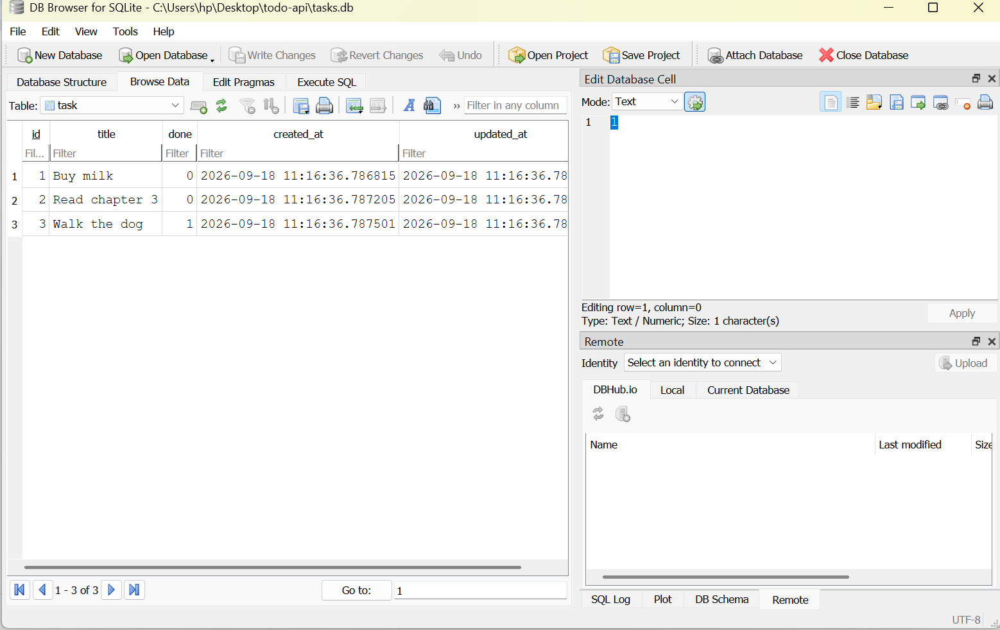

# Todo API

A simple CRUD API for managing tasks, built with FastAPI and SQLModel, backed by a SQLite database, and fully containerized with Docker.

This is the Week 3 project, now extended (Assignment 3) so the whole stack runs with a single command using Docker Compose.

## Why SQLite (instead of Postgres)

This project uses SQLite instead of Postgres for the containerized database. Since Assignment 2 already used SQLite, the app was containerized as-is rather than migrating to a separate Postgres server. SQLite still runs inside the container and behaves like a real, persistent database, the only difference from a Postgres setup is that there is one container instead of two, since SQLite doesn't need a separate database server process.

## How the stack is put together

- app: the FastAPI service, built from the included Dockerfile.
- SQLite database file: stored inside a Docker volume (a folder called data on the host machine), so it survives container restarts and rebuilds.
- .env: holds the DATABASE_URL the app reads at startup. It is gitignored; .env.example is committed instead so anyone cloning the repo knows what variable to set.

## How to start the project

1. Make sure Docker Desktop is installed and running.
2. Copy the example environment file:
   copy .env.example .env
3. Start everything with one command:
   docker compose up
4. Open your browser at http://127.0.0.1:8000/docs

The database file is created automatically inside the data folder on first run, along with three example tasks (only inserted if the table is empty).

## Proving persistence

To confirm data survives restarts:

1. Create a task through POST /tasks.
2. Stop the stack with Ctrl+C, then run docker compose up again, the task is still there (proves the app restarting doesn't lose data).
3. Run docker compose down (which removes the container entirely) and then docker compose up again, the task is still there, because the SQLite file lives in the data volume, not inside the container itself.

Both restarts were tested and the tasks remained exactly as they were before.

## API Endpoints

| Method | Endpoint      | Description                |
|--------|---------------|-----------------------------|
| GET    | /tasks        | List all tasks              |
| GET    | /tasks/{id}   | Get a single task           |
| POST   | /tasks        | Create a new task           |
| PUT    | /tasks/{id}   | Update a task               |
| DELETE | /tasks/{id}   | Delete a task                |
| GET    | /stats        | Task statistics (extra)     |

### Optional query parameters on GET /tasks

- ?search=milk : search tasks by title
- ?done=true : filter by completion status
- ?sort=title : sort tasks alphabetically

## Example SQL query

SELECT * FROM task WHERE done = 1;

This returns every completed task, and the API's GET /tasks?done=true endpoint returns exactly the same rows.

## Screenshot of the database viewer

## What changed from Assignment 2

- The API's URLs, request bodies, and response shapes are unchanged, only the deployment method changed.
- The app and its database file now run inside Docker, started with a single docker compose up command instead of running uvicorn directly on the host machine.
- The database connection string moved out of the code and into an environment variable (DATABASE_URL in .env), read via python-dotenv.
- Data persistence now relies on a Docker volume rather than just a file sitting next to main.py.